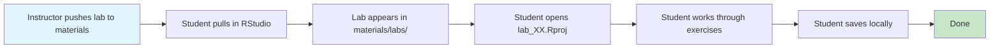
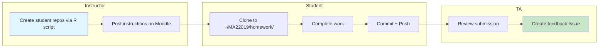
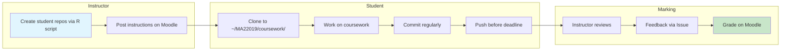

# MA22019 Assignment Deployment Plan

## 📊 Status (Last Updated: 2026-01-26)

| Phase | Status |
|-------|--------|
| **Planning** | ✅ Complete |
| **Student Guides** | ✅ Created (`SETUP_GUIDE.md`, `WEEKLY_WORKFLOW.md`, `TROUBLESHOOTING.md`) |
| **Repo Creation** | ❌ Not started |
| **Automation (R pkg)** | ❌ Not started |
| **TA Materials** | ❌ Not started |

### 🔜 Next Steps for Continuation
1. **Create `materials` repo** on `github.bath.ac.uk/ma22019-2026` (includes labs inside)
2. **Create coursework templates** on `github.bath.ac.uk`
3. **Create homework templates** on `github.bath.ac.uk`
4. **Build `ma22019tools` R package** — start with automation scripts
5. **Write TA marking guide** with Issue templates

### 📁 Files in This Project
| File | Purpose |
|------|---------|
| `SETUP_GUIDE.md` | Student guide: installation, folder structure, first clone |
| `WEEKLY_WORKFLOW.md` | Student guide: when to pull vs clone, semester timeline |
| `TROUBLESHOOTING.md` | Student guide: emergency recovery, common issues |
| `why_teach_github.md` | Student guide: motivation for using Git (comics/analogies) |
| `TRADITIONAL_WORKFLOW.md` | "Fallback" guide for manual workflow (discouraged) |
| `AI_CONTEXT.md` | Quick reference for AI assistants |
| `roster_public.csv` | 187 student usernames |

---

## Course Activities Overview

| Activity | Description | Assessment | Marked By | How Students Get It |
|----------|-------------|------------|-----------|---------------------|
| **Lectures** | Theory + case study demos | None | — | Pull from `materials` |
| **Live Coding** | Coding sessions (Fridays W1-3) | None | — | Pull from `materials/live_coding/` |
| **Labs** | Practice exercises (not graded) | None | — | Pull from `materials` |
| **Homework** | Formative assignments | Formative | TAs | Clone own repo |
| **Coursework 1 & 2** | Summative assessments | **Summative** | Instructor | Clone own repo |

---

## Pull vs Clone: Key Decision

> [!IMPORTANT]
> **Labs are now inside the `materials` repo.** Students pull to get new labs (guaranteed folder location).  
> **Homework and coursework are separate repos.** Students clone their own copy (enables Git history and backup).

### Comparison Table

| Type | How Students Get It | Can Commit? | GitHub Backup? | Folder Location |
|------|---------------------|-------------|----------------|-----------------|
| **Labs** (practice) | Pull from `materials` | ❌ No (read-only) | ❌ No | ✅ Automatic |
| **Homework** (formative) | Clone own repo | ✅ Yes | ✅ Yes | ⚠️ Need guidance |
| **Coursework** (summative) | Clone own repo | ✅ Yes | ✅ Yes | ⚠️ Need guidance |

### Why This Design?

**Labs inside `materials` (Pull)**
- ✅ Folder structure is guaranteed correct — no cloning mistakes
- ✅ Simpler for students — one repo to manage
- ✅ Students just pull weekly to get new labs
- ⚠️ Students cannot commit/backup their lab work to GitHub (but labs are just practice)

**Homework/Coursework as separate repos (Clone)**
- ✅ Personal Git history — students see their own commits, can revert mistakes
- ✅ GitHub backup — if laptop dies, work is safe on github.bath.ac.uk
- ✅ Deadline verification — instructor can check commit timestamps
- ✅ Practice real workflow — clone → commit → push (industry standard)
- ⚠️ Students must clone to the correct folder (need explicit instructions)

---

## Confirmed Decisions

| Decision | Choice |
|----------|--------|
| Primary Platform | **github.bath.ac.uk only** — single platform, no student confusion |
| Labs | **Inside `materials` repo** — students pull to get labs |
| Homework/Coursework | **Separate cloned repos** — students commit and push |
| Folder Structure | **Start simple, transition mid-semester** |
| Folder Structure | **Start simple, transition mid-semester** |
| Student Instructions | **RStudio Git buttons only** — no terminal commands |

### Design Rationale: Why NOT create folders inside `materials`?
We consciously avoid putting empty `homework/` or `coursework/` folders inside the `materials` repo.
- **Risk**: If students clone assignments *inside* the `materials` folder, they create **nested Git repositories**.
- **Result**: The outer `materials` Git confuses the inner homework Git. Students can't push properly.
- **Solution**: We force students to create the parent `MA22019/` folder manually to keep repos sibling-level, not nested.

### Design Rationale: `.gitignore`
We do **not** teach `.gitignore` syntax in Week 1. Instead:
- All assignment templates include a pre-configured `.gitignore`
- It automatically excludes `.DS_Store`, `.Rproj.user`, `.Rhistory`, `.RData`
- Students benefit from clean repos without cognitive overload.

---

## Folder Structure

### Complete Structure (All Phases)

```
~/Documents/MA22019/
├── materials/                  ← Clone once (Week 1), pull weekly
│   ├── README.md
│   ├── case_studies/
│   │   ├── case_study_01/
│   │   │   ├── data/
│   │   │   └── analysis.R
│   │   └── case_study_02/
│   ├── live_coding/
│   │   ├── week_01/
│   │   │   ├── data/
│   │   │   └── demo.R
│   │   └── week_02/
│   ├── labs/                   ← Labs appear here after pull
│   │   ├── lab_01/
│   │   │   ├── lab_01.Rproj
│   │   │   ├── data/
│   │   │   └── lab_01.R
│   │   └── lab_02/
│   └── lab_solutions/          ← Solutions appear here after pull
├── homework/                   ← Students clone each assignment here
│   ├── hw_01-username/         ← Cloned from github.bath.ac.uk
│   └── hw_02-username/
├── coursework/                 ← Students clone each assignment here
│   ├── cw_01-username/         ← Cloned from github.bath.ac.uk
│   └── cw_02-username/
└── data/                       ← Created in Week 5 (shared datasets)
    └── common_datasets/
```

### Phase 1 (Weeks 1–5): Simple, Self-Contained

Each assignment is independent with its own data. Students only need `materials`, `homework`, and `coursework` folders.

### Phase 2 (Weeks 6–11): Linked Structure

In Week 5, students create a shared `data/` folder for common datasets used across multiple assignments.

---

## Lab Workflow (Practice — Not Graded)



### Student Workflow (RStudio)

1. **Open** the `materials` project in RStudio
2. **Pull** updates: Click the blue **Pull** arrow in the Git pane
3. **Open** the lab: Navigate to `labs/lab_XX/` and double-click `lab_XX.Rproj`
4. **Work** through exercises
5. **Save** results locally (Ctrl/Cmd + S)

> [!NOTE]
> **Why can't students commit their lab work?**
> The `materials` repo is read-only for students (they only pull, never push). This is intentional because:
> - Labs are practice and not graded
> - It ensures the folder structure is always correct
> - Students still save their work locally — it's just not backed up to GitHub

### Solutions Distribution

✅ Solutions added to `materials/lab_solutions/` after each lab session.

**How students get solutions:**
1. Instructor pushes solutions to `materials/lab_solutions/lab_XX/`
2. Students open the `materials` project in RStudio
3. Click **Pull** in the Git pane
4. Solutions appear in their local `lab_solutions/` folder

### ⚠️ If Students Edit Materials Files Accidentally

> [!WARNING]
> If students accidentally edit files in `materials/` (e.g., labs), their next **Pull** will fail with merge conflicts.

**Recovery procedure (RStudio-only):**
1. Go to the **Git** pane
2. Right-click the modified file
3. Click **Revert** or **Discard Changes**
4. File returns to original version
5. **Pull** now works again

This is safe because students can always Pull to get the correct content.

---

## Homework Workflow (Formative, TA-Marked)



### Distribution (Automated)

1. Run R script to create individual repos for each student:
   ```r
   create_homework_repos(
     assignment = "hw_01",
     students = roster,
     template = "homework-01-template"
   )
   ```
2. Script automatically:
   - Creates repo `hw_01-{username}` from template
   - Adds student as collaborator (push access)
   - Adds assigned TA as collaborator
3. Post instructions on Moodle with deadline and **explicit clone location**

### Student Clone Instructions (Critical!)

> [!WARNING]
> **Students must clone to the correct folder!** RStudio does not do this automatically.

**Instructions for students:**

1. In RStudio: *File → New Project → Version Control → Git*
2. Paste URL: `https://github.bath.ac.uk/ma22019-2026/hw_01-{your-username}.git`
3. **Important**: For "Create project as subdirectory of:", click **Browse** and navigate to:
   - `~/Documents/MA22019/homework/`
4. Click **Create Project**

**Common mistakes to avoid:**
- ❌ Cloning to Desktop
- ❌ Cloning to Downloads
- ❌ Cloning directly into MA22019/ (should be in homework/ subfolder)

**Verification script** (included in each homework template):
```r
# Run this to check you cloned to the right place
if (grepl("MA22019/homework/hw_01", getwd())) {
  cat("✅ Correct location!")
} else {
  cat("❌ Wrong location. Expected: ~/Documents/MA22019/homework/hw_01-username")
}
```

### Benefits of Cloning Homework (Why Not Just Pull?)

| Benefit | Explanation |
|---------|-------------|
| **Personal Git history** | Students see their own commits, can undo mistakes |
| **GitHub backup** | If laptop dies, work is safe online |
| **Deadline proof** | Instructor can verify when work was pushed |
| **Practice for jobs** | Clone → commit → push is standard industry workflow |

### TA Marking

- **Allocation**: ~60 students per TA (alphabetical or tutorial group)
- **Feedback**: Via GitHub Issues on student repos
- **Deadline check**: Instructor verifies last commit timestamp

### Feedback Via Issues

> [!NOTE]
> **What are GitHub Issues?**
> Issues are a built-in discussion/ticket system on every GitHub repository. They're commonly used for bug reports and feature requests, but we repurpose them for assignment feedback.

**How TAs use Issues for feedback:**

| Step | What TA Does |
|------|-------------|
| 1 | Open student's homework repo on github.bath.ac.uk |
| 2 | Click the **"Issues"** tab (top of page) |
| 3 | Click **"New Issue"** button |
| 4 | Give it a title like "Homework 1 Feedback" |
| 5 | Write feedback using the template below (supports markdown) |
| 6 | Click **"Submit new issue"** |

**Student receives:**
- Email notification (to their @bath.ac.uk email)
- Can view feedback directly in their repo's Issues tab
- Can reply to ask clarification questions

**Why Issues instead of email?**
- Feedback is attached to the code (context preserved)
- Student can reply/ask questions in one thread
- You have a permanent record of all feedback given
- TAs can use templates for consistent formatting

**Example Issue from TA:**

```markdown
## Homework 1 Feedback

**Grade**: Satisfactory ✓

### What worked well
- Good use of dplyr verbs
- Clean code formatting

### Suggestions for improvement
- Consider using `case_when()` instead of nested `ifelse()`
- Add comments explaining your approach
```

---

---

## Late Submission Policy

### Homework (Formative)

| Condition | What Happens |
|-----------|-------------|
| Push **before** deadline | ✅ TA provides written feedback |
| Push **after** deadline | ❌ No feedback given |

> [!NOTE]
> Homework is for learning — there are no marks or grades. The only consequence of late submission is missing out on TA feedback.

**TA workflow for checking lateness:**
1. Run `check_submission_status("hw_01", deadline = "2026-02-15 17:00")`
2. Script returns list: on-time vs late submissions
3. TAs only create feedback Issues for on-time submissions

### Coursework (Summative)

| Condition | What Happens |
|-----------|-------------|
| Push **before** deadline | ✅ Marked normally |
| Push **after** deadline | ⚠️ University late penalty applies |

**Deadline verification:**
1. Instructor runs `check_submission_status("cw_01", deadline = "2026-03-20 12:00")`
2. Script checks last push timestamp for each student
3. Late submissions flagged for penalty calculation

---

## Coursework Workflow (Summative, Instructor-Marked)



### Student Clone Instructions

Same as homework, but clone to `~/Documents/MA22019/coursework/`:

1. In RStudio: *File → New Project → Version Control → Git*
2. Paste URL: `https://github.bath.ac.uk/ma22019-2026/cw_01-{your-username}.git`
3. **Important**: Browse to `~/Documents/MA22019/coursework/`
4. Click **Create Project**

### Marking

- **Only instructor marks** (no TA involvement)
- Feedback via Issues or direct annotation
- Final grade recorded in Moodle gradebook

---

## Materials Repo Structure

```
github.bath.ac.uk/ma22019-2026/materials
├── README.md                 # Instructions for pulling updates
├── case_studies/
│   ├── case_study_01/
│   └── case_study_02/
├── live_coding/
│   ├── week_01/
│   └── week_02/
├── labs/                     # Labs appear here as they're released
│   ├── lab_01/
│   │   ├── lab_01.Rproj
│   │   ├── data/
│   │   └── lab_01.R
│   └── lab_02/
└── lab_solutions/            # Solutions released after each lab
    ├── lab_01/
    └── lab_02/
```

### Student Workflow (RStudio — No Terminal!)

1. **Week 1**: Clone materials repo once
   - In RStudio: *File → New Project → Version Control → Git*
   - URL: `https://github.bath.ac.uk/ma22019-2026/materials.git`
   - Create in: `~/Documents/MA22019/`

2. **Before each session**: Pull updates
   - Open the `materials` project in RStudio
   - In the Git pane (top-right), click **Pull** (blue down arrow)
   - New labs and solutions appear automatically in the correct folders

---

## Timeline & Communication (11-Week Semester)

### Week 1 (Lab 1: Setup Session)

**Topics** (all via RStudio, no terminal):

1. Install R + RStudio (if needed)
2. Configure Git in RStudio (*Tools → Global Options → Git/SVN*)
3. Clone `materials` repo from github.bath.ac.uk
4. Verify setup with test pull
5. **Create folder structure** for future cloned repos

**Step 4: Verify Setup with Test Pull (Detailed)**

| Timing | Who | Action |
|--------|-----|--------|
| Before lab | Instructor | Push a test file to `materials` (e.g., `test_pull.txt`) |
| During lab | Students | After cloning, click **Pull** in RStudio Git pane |
| During lab | Students | Verify `test_pull.txt` appears in their Files pane |
| After lab | Instructor | (Optional) Delete `test_pull.txt` from repo |

**What if a student's pull fails?**
- Check they opened the correct project (Git pane should be visible)
- Check internet connection / VPN if off-campus
- Try closing and reopening RStudio
- Last resort: delete local folder and re-clone

**Step 5: Create Folder Structure for Cloned Repos**

Students create empty folders for future homework/coursework:

| Step | RStudio Action |
|------|----------------|
| 1 | *File → Close Project* (to exit materials) |
| 2 | In Files pane, navigate to `~/Documents/MA22019/` |
| 3 | Click **New Folder** → type `homework` |
| 4 | Click **New Folder** → type `coursework` |

**Communicate:**
- Folder structure expectations
- Where to clone homework (into `homework/`)
- Where to clone coursework (into `coursework/`)
- How to get help (office hours, forum)

### Week 5 (Transition)

**Communicate:**
- Folder structure changing (add shared `data/` folder)
- Provide migration instructions (using RStudio Files pane)
- Verification script to check setup

---

## R Automation Package (To Build)

> [!IMPORTANT]
> Since we're not using GitHub Classroom, automation is essential for managing 180+ students.

### Core Functions

```r
# ma22019tools (working name)

# ---- Roster Management ----
read_roster("students.csv")  # Standardize student data

# ---- Repo Creation ----
create_student_repos(
  assignment = "hw_01",
  students = roster,
  template = "homework-01-template",
  tas = c("ta1", "ta2", "ta3")  # Auto-assign TAs
)

# ---- Bulk Operations ----
add_collaborators(repos, users, permission = "push")
assign_tas_alphabetically(students_df, ta_list)
check_submission_status(assignment = "hw_01", deadline = "2026-02-15 17:00")

# ---- Reporting ----
generate_submission_report(assignment = "hw_01")  # Who pushed before deadline?
generate_ta_report(ta_username)                   # List all assigned students

# ---- TA Accountability ----
check_ta_progress(assignment = "hw_01")           # Which students have feedback Issues?
```

### Automation Priority

| Priority | Function | Saves |
|----------|----------|-------|
| 🔴 High | `create_student_repos()` | Hours per assignment |
| 🔴 High | `check_submission_status()` | Manual timestamp checking |
| 🟡 Medium | `assign_tas_alphabetically()` | TA allocation time |
| 🟡 Medium | `check_ta_progress()` | Monitor TA marking progress |
| 🟢 Low | `generate_ta_report()` | Convenience |

---

## Moodle Integration

| Use Moodle For | Use GitHub For |
|----------------|----------------|
| Announcements & deadlines | All code & materials |
| Assignment instructions (with clone URLs) | Student repos |
| Final gradebook (summative marks) | Feedback via Issues |
| Course calendar | README documentation |

---

## Clear Guidance Documents (To Create)

### For Students

| Document | Purpose | Key Content |
|----------|---------|-------------|
| `SETUP_GUIDE.md` | Initial setup | RStudio + Git config, folder structure |
| `WEEKLY_WORKFLOW.md` | Week-by-week tasks | When to pull vs clone, where to clone |
| `TROUBLESHOOTING.md` | Common issues | "I cloned to wrong folder" solutions |

### For TAs

| Document | Purpose | Key Content |
|----------|---------|-------------|
| `TA_MARKING_GUIDE.md` | How to mark homework | Issue templates, feedback standards |
| `TA_ACCESS_SETUP.md` | Getting access | How to access assigned student repos |

### For Instructor (Self)

| Document | Purpose | Key Content |
|----------|---------|-------------|
| `DEPLOYMENT_SCRIPTS.md` | Running automation | Step-by-step for each assignment type |
| `SEMESTER_CHECKLIST.md` | Week-by-week admin | What to release when |

### For AI Assistant (Future Sessions)

| Document | Purpose | Key Content |
|----------|---------|-------------|
| `AI_CONTEXT.md` | Quick project understanding | Overview, key decisions, file map, terminology |

**`AI_CONTEXT.md` should include:**

1. **Project Overview**: MA22019 Data Science course, 180+ students, 3 TAs, github.bath.ac.uk only
2. **Key Decisions Made**:
   - Single platform (github.bath.ac.uk) — no GitHub Classroom
   - Labs inside `materials` repo (students pull)
   - Homework/coursework as separate cloned repos (students clone)
   - RStudio buttons only — no terminal commands for students
3. **File Map**:
   - `assignment_deployment_plan.md` — main plan (this file)
   - `platform_comparison.md` — reference for why we chose single platform
   - `assignment_deployment_plan_hybrid_backup.md` — backup of old approach
4. **Repository Structure**:
   - `materials` repo: case studies, live coding, labs, lab solutions
   - Per-student repos: `hw_XX-username`, `cw_XX-username`
5. **Terminology**:
   - "Pull" = get updates from materials repo (labs, solutions)
   - "Clone" = create a copy of homework/coursework repo
   - "Issues" = GitHub's discussion system used for TA feedback

---

## Next Implementation Steps

1. [ ] Create `materials` repo structure on `github.bath.ac.uk` (with labs inside)
2. [ ] Create first lab inside materials repo
3. [ ] Create coursework templates on `github.bath.ac.uk`
4. [ ] Create homework templates on `github.bath.ac.uk`
5. [ ] Write `SETUP_GUIDE.md` for students (RStudio-focused, no terminal)
6. [ ] Write `WEEKLY_WORKFLOW.md` with clear pull-vs-clone instructions
7. [ ] Build first automation functions (`create_student_repos`)
8. [ ] Write TA marking guide with Issue templates
9. [ ] Test full workflow with dummy student

---

## 📝 Open Questions & Future Work (Notes for Next Session)

1.  **R Package Management**:
    *   Need a way to manage requirements (e.g., `renv` or `install_packages.R` script).
    *   *Idea*: Host a `requirements.R` in the `materials` repo that students run weekly.
2.  **Test Deployment**:
    *   Action: Run a full test with a "dummy" student and repo to demonstrate the workflow to the instructor.
3.  **Repository Visibility**:
    *   **Student Repos**: Must be **Private** (to prevent plagiarism).
    *   **Materials Repo**: Public (to organization) or Internal.
    *   **Templates**: Public (to organization) or Internal.
